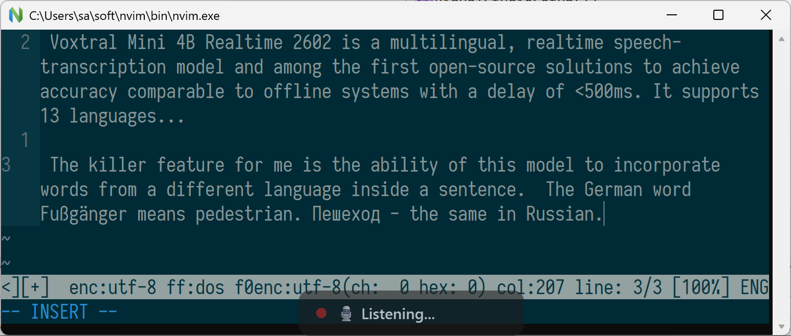
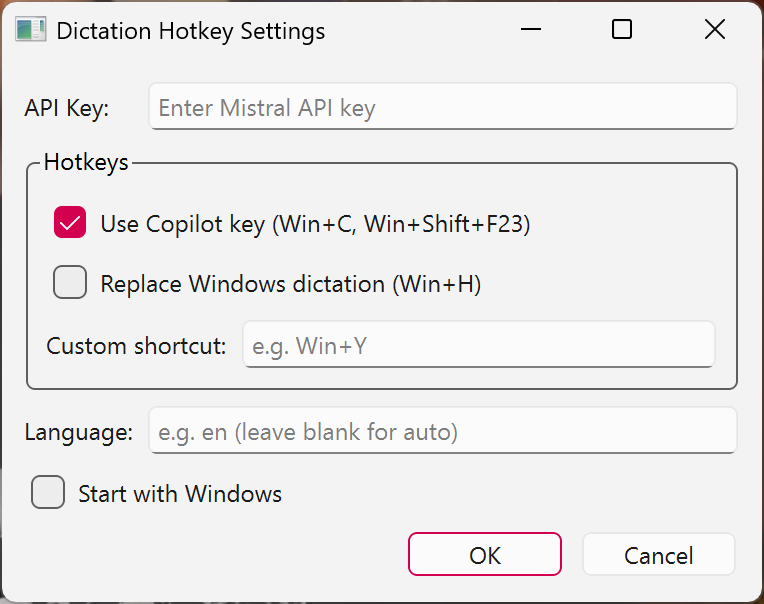

# Dictation Hotkey

I was impressed by the `mistralai/Voxtral-Mini-Realtime` model and wanted to use it as a dictation app for Windows.
Before downloading, you might want to try the [online demo](https://huggingface.co/spaces/mistralai/Voxtral-Mini-Realtime) provided by Mistral.

## Features

- **Real-time transcription** — text appears as you speak, not after you stop
- **Multiple hotkey options** — Win+H (replaces Windows dictation), Copilot key, or a custom shortcut
- **On-screen overlay** — shows recording status; click to stop
- **Escape to cancel** — press Esc at any time to stop recording
- **Single-file exe** — no installation required

## Getting Started

Download `DictationHotkey.exe` from the [latest release](../../releases/latest) and run it.

### Prerequisites

- A [Mistral API key](https://console.mistral.ai/) with access to the real-time transcription API

### Build

See [github workflow file](./.github/workflows/build.yml).
**Beware:** most of the code was AI-generated. The code quality is poor.
