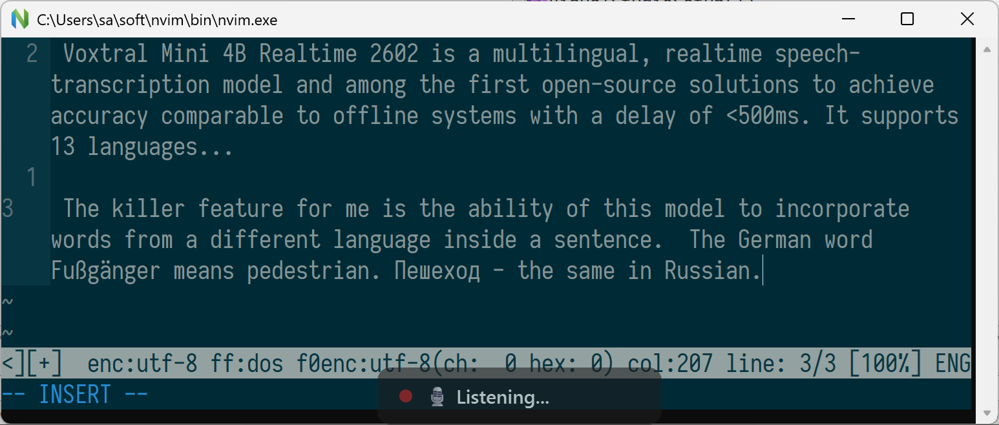
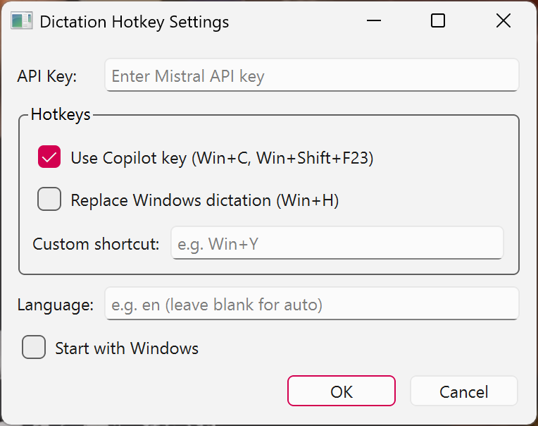

# Dictation Hotkey

I was impressed by the `mistralai/Voxtral-Mini-Realtime` model and wanted to use it as a dictation app for Windows.
Before downloading, you might want to try the [online demo](https://huggingface.co/spaces/mistralai/Voxtral-Mini-Realtime) provided by Mistral.

Runs on **Windows** and **macOS**. On macOS it can use the built-in, on-device
Speech framework (no API key needed) or the Mistral cloud API.




## Features

- **Real-time transcription** — text appears as you speak, not after you stop
- **Choice of speech provider (macOS)** — native on-device `SFSpeechRecognizer` (default) or Mistral realtime API
- **Multiple hotkey options** — Win+H (replaces Windows dictation), Copilot key, or a custom shortcut (default on macOS: Option+Space)
- **On-screen overlay** — shows recording status; click to stop
- **Escape to cancel** — press Esc at any time to stop recording
- **Single-file exe** — no installation required (Windows)



## Getting Started

### Windows

Download `DictationHotkey.exe` from the [latest release](../../releases/latest) and run it.

#### Prerequisites

- A [Mistral API key](https://console.mistral.ai/) with access to the real-time transcription API

### macOS

Download `DictationHotkey-macOS-AppleSilicon.dmg` (M1/M2/M3/M4) or
`DictationHotkey-macOS-Intel.dmg` from the [latest release](../../releases/latest),
drag the app to Applications, and launch it.

The app is ad-hoc signed (no Apple Developer account), so the first launch must be:
**right-click the app → Open → Open**, or remove the quarantine flag:

```
xattr -dr com.apple.quarantine /Applications/DictationHotkey.app
```

On first use macOS will ask for these permissions:

- **Speech Recognition** and **Microphone** — for the native provider
- **Accessibility** (System Settings → Privacy & Security → Accessibility) — required for the global hotkey and for typing text into other apps

No Mistral API key is needed with the default native provider. Select "Mistral API (cloud)" in Settings to use Mistral instead.

To run from source instead:

```
pip install -r requirements.txt
python main.py
```

When running from source, the permissions are attributed to your terminal app.

### Build

See [github workflow file](./.github/workflows/build.yml) — it builds the Windows exe
and macOS app bundles (Apple Silicon + Intel DMGs) and attaches them to tag releases.
**Beware:** most of the code was AI-generated. The code quality is poor.

#### Signing and notarizing the macOS build

CI ad-hoc signs the bundle, which is enough for personal use. To distribute to other
Macs without the right-click-Open workaround you need an Apple Developer account:

```
codesign --force --deep --options runtime --timestamp \
  --sign "Developer ID Application: Your Name (TEAMID)" dist/DictationHotkey.app
xcrun notarytool submit DictationHotkey.dmg \
  --apple-id you@example.com --team-id TEAMID --password app-specific-password --wait
xcrun stapler staple DictationHotkey.dmg
```

The hardened runtime (`--options runtime`) is required for notarization.

## Platform notes

| | Windows | macOS |
|---|---|---|
| Speech-to-text | Mistral realtime API | Speech framework (native, on-device) or Mistral |
| Typing | `SendInput` Unicode events | Quartz `CGEvent` Unicode events |
| Global hotkey | low-level keyboard hook | Quartz `CGEventTap` |
| Autostart | Startup folder shortcut | `~/Library/LaunchAgents` plist |
| Config | `%APPDATA%\dictation_hotkey` | `~/Library/Application Support/dictation_hotkey` |
