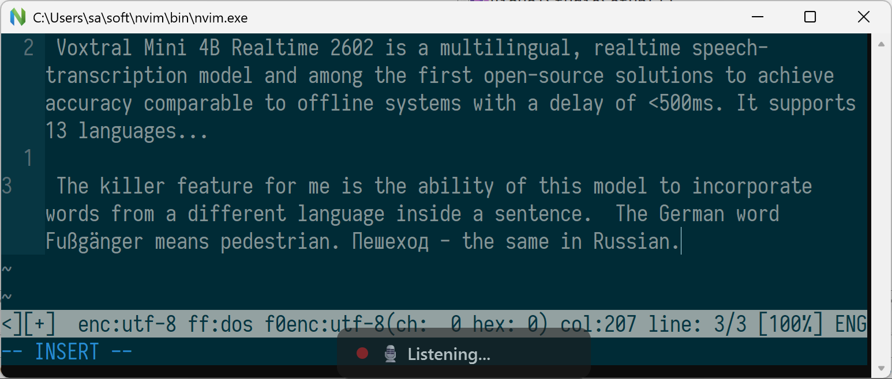
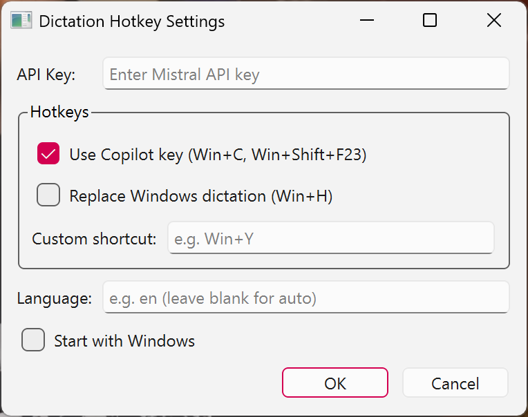

# Dictation Hotkey

I was impressed by the `mistralai/Voxtral-Mini-Realtime` model and wanted to use it as a dictation app for Windows and macOS.
Before downloading, you might want to try the [online demo](https://huggingface.co/spaces/mistralai/Voxtral-Mini-Realtime) provided by Mistral.




## Features

- **Real-time transcription** — text appears as you speak, not after you stop
- **Multiple hotkey options** — Win+H (replaces Windows dictation), Copilot key, or a custom shortcut; macOS defaults to Control+Option+D
- **On-screen overlay** — shows recording status; click to stop
- **Escape to stop** — press Esc at any time to stop and submit the recording
- **Batch transcription mode** — records first, then uploads a bounded temporary WAV to Mistral
- **Native applications** — Windows executable and macOS menu-bar app; no Python, Qt, or bundled speech model required



## Native Rust application

Dictation Hotkey shares a Rust session engine, bounded audio queues, temporary WAV spool, configuration and Mistral protocol across Windows and macOS. Windows uses Win32, WASAPI and WinHTTP. macOS uses a small Swift adapter for AppKit, AVAudioEngine, URLSession, global shortcuts and native text insertion. The Windows controller lives in `src/platform/windows/`; macOS adapters live in `src/platform/macos/`.

## Getting Started

Download `DictationHotkey.exe` from the [latest release](../../releases/latest) and run it.

### Prerequisites

- Windows 10/11 x64, or macOS 13+ on Apple Silicon or Intel
- A [Mistral API key](https://console.mistral.ai/) with access to the transcription APIs
- An internet connection — both realtime and batch modes use Mistral's cloud APIs, not local speech recognition

### Usage

1. Run `DictationHotkey.exe` and enter your API key in Settings.
2. Select Win+H, the Copilot key, or a custom shortcut; macOS defaults to Control+Option+D, then save your settings.
3. Focus the window where you want text inserted and press the shortcut to start dictating.
4. Press the shortcut again, press Esc, or click the overlay to stop.

Right-click the tray icon for Settings, Logs, Copy Last Text, batch mode, and Quit. Left-click the tray icon to start a clipboard-only recording instead of typing into the focused window.

Settings are stored in `%APPDATA%/dictation_hotkey/config.json`. Existing settings from the Python app remain compatible; the first pre-native configuration is backed up as `config.pre-native.json` when settings are saved.

### macOS

Build from source using the instructions below, or use the matching `DictationHotkey-macos-arm64.zip` / `DictationHotkey-macos-x64.zip` release artifact. Move **Dictation Hotkey.app** to Applications and launch it. Open Settings from the microphone menu-bar icon and enter your Mistral API key.

Control+Option+D toggles recording. Configure a different shortcut using Control, Option, Command or Shift plus a letter, digit or F1–F20. Shortcuts use physical key positions; Command+V is reserved for paste output. Use the shortcut, overlay Stop button or menu Stop to finish; Escape also works when macOS allows keyboard monitoring. Record to Clipboard captures without inserting into the focused app.

Allow Microphone access when prompted. For insertion, select **Enable Text Insertion…** and grant Accessibility access in System Settings → Privacy & Security. Paste uses Command+V; Unicode keystrokes are also available. If insertion fails, the transcript remains available through Copy Last Text. After partial realtime insertion, batch fallback keeps the complete result for copying without reinserting it.

The menu shows **Text Insertion Enabled** with a checkmark only when the running app has permission to post keyboard events. Focus a text field and use the recording shortcut after approving access. Local ad-hoc builds have a different signing identity after each code change: if Accessibility already shows an enabled entry but the app reports missing permission, quit the app, remove that entry, add the current `.app` from its installed location, enable it, and reopen the app. Developer ID signing (`tools/package_macos.py --identity ...`) provides a signing identity that can remain consistent across updates.

Settings live in `~/Library/Application Support/dictation_hotkey/config.json`; temporary audio lives in `~/Library/Caches/dictation_hotkey/spool/` and is deleted when the session ends. The optional Start at Login setting uses macOS Login Items and must be enabled explicitly. Approve it in System Settings if macOS requests approval.

macOS packages are ad-hoc signed by default and are not notarized. See BUILDING.md for signing and the manual validation checklist.

### Build from source

Install Rust 1.99.0 and MSVC Build Tools with the C++ tools and Windows SDK. From the repository root:

```powershell
cargo fmt --check
cargo clippy --locked --all-targets -- -D warnings
cargo test --locked
cargo build --release --locked --target x86_64-pc-windows-msvc
```

The executable is `target/x86_64-pc-windows-msvc/release/dictation-hotkey-native.exe`; rename it to `DictationHotkey.exe` for distribution. Python and Qt are not needed to build or run the app.

For macOS, install Xcode Command Line Tools (`xcode-select --install`) and Rust 1.99.0, then run:

```sh
cargo fmt --check
cargo clippy --locked --all-targets -- -D warnings
cargo test --locked
python3 tools/package_macos.py
```

The app is created in `dist/macos-arm64/Dictation Hotkey.app` (or `macos-x64` on Intel). `cargo run --locked` is available for development; use the installed app bundle for stable permissions and Login Items.

See [`BUILDING.md`](BUILDING.md) for toolchain installation, cross-building, and opt-in Windows tests. The [GitHub workflow](./.github/workflows/build.yml) builds Windows and macOS packages with SHA-256 checksums.

### Validation

Build and smoke-test results and remaining manual checks are documented in [`benchmarks/WINDOWS_VALIDATION.md`](benchmarks/WINDOWS_VALIDATION.md). Authenticated transcription, microphone recording, and clean-machine behavior still require validation before broad publication.

**Beware:** most of the code was AI-generated. Review and smoke-test on Windows before relying on a new release.
